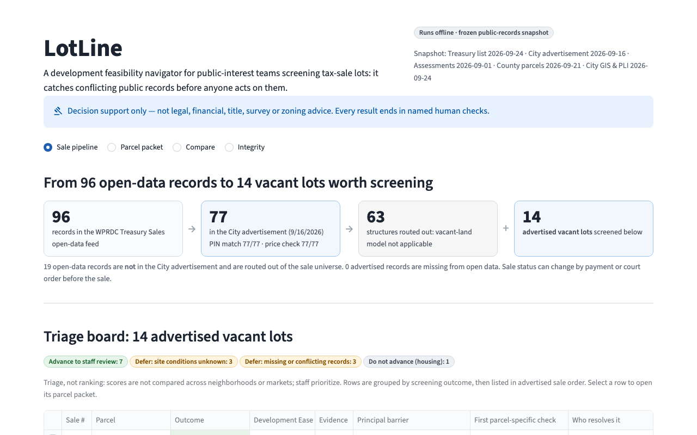
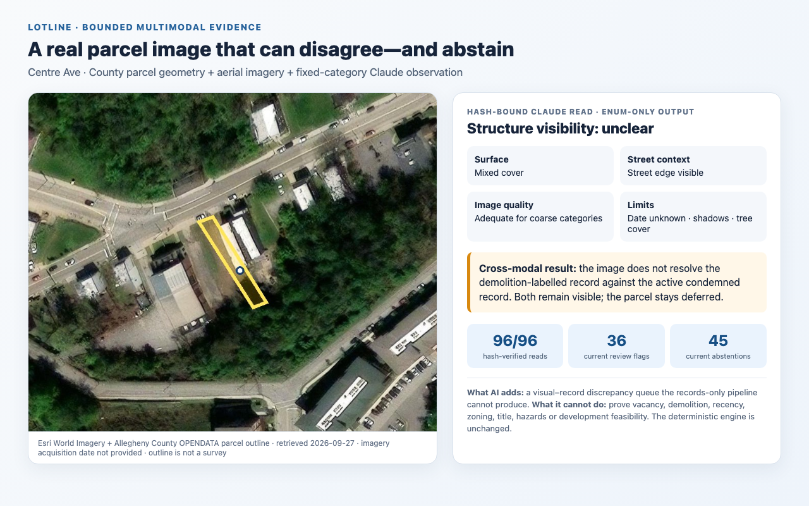
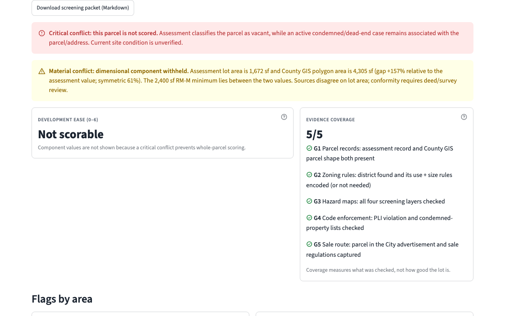

# LotLine

**An AI-assisted, multimodal feasibility navigator that reads messy property histories, checks them against real parcel imagery, and shows analysts what must be resolved before paid diligence begins.**

AI Horizons 2026 AI for Housing Hackathon · Challenge 1: Development Feasibility & Pro Forma Navigator · Startup track



> **Decision support only.** LotLine is a screening aid for staff review. It is not legal, financial, title, survey or zoning advice, and it never states that a parcel has final development approval. Every packet ends in named human checks.

## The problem

Housing acquisition teams do not receive one clean parcel record. They receive dated and sometimes contradictory assessment fields, parcel geometry, zoning rules, sale notices, condemnation cases, permit references and aerial imagery. A row labelled “vacant” may still have a structure-like footprint in the image or an active condemned case in its history. A parcel can also cross a zoning threshold depending on which official area record is used.

LotLine turns that reconciliation problem into an auditable review queue. In the October 2, 2026 Pittsburgh Treasurer Sale snapshot:

- **96** parcels appear in the open-data feed, while **77** appear in the City advertisement.
- Of the advertised parcels, **63** route out as structures and **14** enter the vacant-lot feasibility screen.
- The engine advances **7** to staff review, defers **3** for site evidence, defers **3** for record conflicts, and marks **1** as not advancing for housing.
- One “vacant” parcel has official area records of **1,672 sq ft and 4,305 sq ft**, on opposite sides of its 2,400 sq ft zoning minimum. LotLine displays both and withholds the score.
- A separate city-scale join finds **536 parcel IDs** in both a 22,354-parcel vacant-assessment set and a 2,895-parcel active-condemned set. This quantifies a records-reconciliation workload; it does not establish present site condition.

## What the AI actually does

LotLine uses Claude only where the evidence is unstructured or visual. It never delegates the parcel decision to the model.

| AI capability | Input | Constrained output | Deterministic safeguard |
|---|---|---|---|
| Enforcement-record reader | Longitudinal orders, inspections, court notes, permits and status text | Candidate event-bearing record IDs and exact quotes | Code rechecks record identity, dates, fields and verbatim quote spans; unsupported semantics are withheld |
| Parcel-image observer | Real aerial image with the target County parcel polygon outlined | Enum-only footprint, surface, street-context and image-quality observations | Schema validation, image and prompt hashes, fixed limitation vocabulary, and no access to engine decisions |
| Ask LotLine | A natural-language analyst question | A fixed answer frame plus approved claim and code-excerpt IDs | Only engine-authored claims and verbatim cited excerpts reach the UI; unsupported requests are declined |
| Memo selector | An engine-produced claim set | Ordering and selection of immutable claim IDs | Unknown or malformed selections fall back to the deterministic cited memo |

The governing separation is simple:

```text
records + cited rules ──> deterministic engine ──> outcome, score, barriers, next checks
          │
          ├──> Claude text reader ──> source-verified evidence candidates ──┐
          └──> parcel image + outline ──> bounded visual observations ─────┤
                                                                          └──> human review, never an engine override
```

## Multimodal parcel audit

This is a working image-and-record audit, not a decorative map. All **96 sale-feed parcels** have:

1. a source-cached Esri World Imagery view;
2. the queried Allegheny County OPENDATA parcel polygon drawn over the image;
3. a content hash tying the image to its cached model read;
4. a schema-constrained Claude observation;
5. a deterministic comparison against verified record semantics and assessment class; and
6. an explicit result: visual support, review-worthy tension, or abstention.



The full-cohort audit produced:

| Result | Current evidence |
|---|---:|
| Valid bounded visual reads | **96/96** |
| Footprint categories | **3 clearly visible · 48 not visible · 45 unclear** |
| Records-versus-image review flags | **36/96** |
| Flags among records routed as structures | **29** |
| Exact footprint-category agreement across two consecutive runs | **93/96** |
| Flag-count range across those runs | **35–36** |
| Abstention-count range across those runs | **44–45** |

The useful output is the discrepancy queue. For example, a structure-routed record with no clear footprint visible becomes a named human-review case. An `unclear` image stays unresolved. Centre Avenue remains unresolved even after image review; the UI continues to show both records and withholds the score.

The imagery does **not** establish vacancy, demolition, structural condition, legal access, lot boundaries on the ground or development feasibility. Its acquisition date is unavailable. The yellow parcel line comes from County geometry and is not a survey. Visual observations cannot change routing, an outcome or a score.

## The measurable AI delta—and its limit

Without the visual model, the engine can compare structured records but performs **no pixel analysis**; every records-versus-image discrepancy requires a person to inspect the imagery manually. With the bounded observer, all 96 images receive the same coarse screen and potentially discordant cases are routed into a review queue. That is the multimodal contribution demonstrated by this prototype.

For text retrieval, a balanced 150-parcel development sample compared a frozen `k=1` Claude reader with deterministic alternatives. Claude made **0/75** demolition assertions discordant with the active-condemned/no-demolition-permit proxy stratum, while the strongest pre-call rule by F1 (B4) made **15/75**. Claude found 30/75 permit-reference demolitions versus 46/75 for B4; B4 also had higher F1 (**.676 versus .571**). A stronger post-hoc contextual rule (B5) made 2/75 proxy-discordant assertions and found 35/75, with F1 .625. Claude therefore traded recall and F1 for proxy precision in this development analysis.

These results support a conservative precision advantage over the frozen simple baseline—not LLM necessity, overall superiority, predictive accuracy, causal time savings or proof of present site condition. The image study has no site-truth labels. Handcrafted computer vision, open building-footprint overlays and task-specific detectors remain unevaluated alternatives. The current live text reader also differs from the frozen evaluated configuration by using a three-run union and same-model entailment check.



## What the analyst receives

Enter a parcel ID and get a cited screening packet containing:

- the routing outcome and a transparent Development Ease result;
- every score component or an explicit withheld state—unknown is never converted to zero;
- evidence coverage separated from feasibility;
- zoning, environmental, infrastructure and policy flags;
- the principal barrier;
- records-versus-imagery evidence with provenance and limitations; and
- exact next checks assigned to the responsible human specialist.

LotLine triages; staff decide. The intended user is a public-interest acquisition analyst at a Land Bank, redevelopment authority, CDC or public agency screening a sale list before committing title, survey and specialist-review funds.

## Pilot hypothesis

A proposed one-sale-cycle pilot would test an agency-team license of **$2,500 per sale cycle** and subsidized CDC access at **$500**. One acquisitions analyst would own the queue while a data steward refreshes each public-source snapshot. The pilot would measure analyst hours to a review-ready shortlist, title or survey spending not yet committed on unresolved cases, and packets accepted without a missing owner or next check. These buyers, prices and savings are hypotheses—not measured willingness to pay or demonstrated savings. LotLine has no affiliation with the City, URA, Pittsburgh Land Bank or any other agency.

## Status

Built during the AI Horizons 2026 AI for Housing Hackathon (Sat Sep 26, 09:00 ET to Sun Sep 27, 2026).

## Repository layout

| Path | Contents |
|---|---|
| `lotline/` | Application code (written during the build window) |
| `data/` | Prepared, cited snapshot inputs loaded by the app |
| `tests/` | Test suite; `tests/fixtures/expected_labels.csv` is test-only and never loaded by the app |
| `docs/` | Build contract, implementation history, scientific validation, demo runbook and fallback artifacts |
| `docs/prep/` | Pre-event data-exploration artifacts (plan PDF, prep-pack notes, legacy golden set — never loaded by the app) |

## Pre-event data preparation (disclosure)

Per the hackathon rules, ideas and data exploration may precede kickoff; code may not. The following were prepared **before** the build window as data, not code, and are committed as-is in the first commit:
`data/parcel_facts.csv`, `data/district_rules.csv`, `data/source_manifest.csv`, `data/treasury_sale_2026-10-02_enriched.csv`, `data/advert_2026-09-16_reconciliation.csv`, `tests/fixtures/expected_labels.csv`, and the documentation files present in that initial commit. Later implementation, validation, multimodal, demo and handoff artifacts in `docs/` were created or updated during the build window.
After kickoff, `scripts/split_answer_keys.py` (written in-window) moved the prepared advertisement-match columns out of the app-loaded CSVs into `tests/fixtures/expected_reconciliation.csv` and dropped household-identifying columns (homestead flag, owner category, deed type/price/date) from the Treasury snapshot. No owner names are stored.
Pre-event exploration queries (CKAN, ArcGIS, PASDA) were run ad hoc and were not kept; no code from them is in this repository. Files in `docs/prep/` are historical and may reference earlier file names (e.g. a v6 plan PDF, review prompts that are not included, and advertisement columns that now live in test fixtures).

The manual split, district rules, source manifest, polygon zoning, slope25, undermining, FEMA, historic, RCO, street-proximity and approximate geometry fields came from pre-event exploration of public sources. No reusable transformation script existed before kickoff; all loaders, engine logic and tests are written during the build window.

## AI tool disclosure

- **Claude Code**: coding assistant used during the build.
- **OpenAI Codex**: used before the build to review the plan and restructure prepared CSVs, and during the build to review, test and implement parts of the application and documentation.
- **Claude (Anthropic API)**: optional runtime reader for unstructured enforcement records, bounded question router over engine-authored claims and cited code excerpts, memo claim selector, and enum-only observer of parcel imagery. Model output never changes routing, an engine outcome or score.

## Libraries

Python 3.12, Streamlit, pandas, anthropic, pytest (dependencies are locked in `uv.lock`).

## How to run

Requires [uv](https://docs.astral.sh/uv/) (it installs Python 3.12 and the locked dependencies).

```bash
uv sync                            # install the locked environment
uv run streamlit run app.py      # opens http://localhost:8501; works fully offline
uv run pytest -q                 # full test suite
uv run python -m evaluation.run  # reproduce all 11 scientific evaluation sections
```

Optional: set `ANTHROPIC_API_KEY` to run the record reader, Ask LotLine, cited memo assembly and live parcel-image observer. Verified caches keep the headline evidence available offline. When the key, network or model is unavailable, deterministic screening and memo output remain available.

## How it works

**Claude reads the record. Rules decide. Code verifies source identity, recorded dates and every displayed quote.**

1. **Immutable snapshots** (`lotline/loaders.py`). Cached CSVs are loaded with explicit column allowlists and validated at startup (schemas, unique PINs, dates, and the universe counts 96 / 77 / 19 / 63 / 14). Answer-key columns cannot be selected, and test labels are never read by the app.
2. **Runtime reconciliation** (`lotline/reconcile.py`). The City advertisement is matched to the WPRDC list by normalized PIN, with the upset price as a cross-check.
3. **Flat, cited facts** (`lotline/facts.py`). Every value becomes a fact `PIN:field:source` with its source and as-of date. District rules become `RULE:district:field` facts.
4. **Deterministic engine** (`lotline/engine/`). Pure functions own routing, conflict detection (critical / material / disclose), use entitlement, the illustrative setback screen, hazard families, evidence coverage, the Development Ease result, barriers and next checks. All thresholds live in `lotline/engine/policy.py`. Unknown inputs are withheld, never scored as zero.
5. **Verified AI readers** (`lotline/ai/`). The enforcement reader searches longitudinal record prose for event-bearing quotes; exact IDs, fields, dates and quotes are rechecked, and unsupported semantic labels are withheld. The current live reader unions proposals from three same-model runs, exposes how many runs proposed each quote, and applies a same-model entailment check; recurrence is reported, not required for inclusion. Code may attach an exact structured status field from an AI-surfaced condemned record as deterministic enrichment. Ask LotLine maps natural questions to fixed answer frames, engine claim IDs and verbatim code excerpts; no model-written prose reaches the UI. ZBA extraction is secondary and is not used to predict approval.
6. **Bounded multimodal cross-check** (`lotline/ai/visual.py`). All 96 sale-feed parcels have real imagery paired with a County parcel outline. Claude returns enum-only visual observations; code validates the vocabulary, rechecks cached image hashes, and compares the result with verified record semantics and the assessment class. An image may corroborate, challenge or fail to resolve the records, but never validates or changes the engine decision. The full-cohort audit and records-only counterfactual are reproduced in section 11 of [`docs/validation/results.md`](docs/validation/results.md).
7. **Memo and claim checker** (`lotline/memo/`). A deterministic cited memo is always available. Claude may optionally select and order immutable engine-approved claim IDs. Unknown, duplicate, malformed or rejected selections fall back to the deterministic memo.
8. **Streamlit UI** (`app.py`, `lotline/ui/`) renders engine output only. It has four views: sale pipeline and triage, parcel packet, compare, and integrity.

## Data sources

All sources are public. Snapshot dates are shown in the app and recorded in `data/source_manifest.csv`.

| Source | Identifier | As of |
|---|---|---|
| City Treasury Sales (WPRDC) | resource `6b2aa631-26e0-4d02-abe0-7fb87707210c` | pulled 2026-09-24 |
| City advertisement "Available for Auction as of 9/16/2026" | pittsburghpa.gov/files/assets/city/v/2/finance/documents/real-estate-forms/available-for-auction-9-16-2026.pdf | 2026-09-16 |
| Treasurer Sale regulations for the 10/2/2026 sale | pittsburghpa.gov/files/assets/city/v/3/finance/documents/real-estate-forms/regulations-10-2-26-pdf.pdf | 2026-10-02 sale |
| Second Class City Treasurer's Sale and Collection Act | Act of Oct. 11, 1984, P.L. 876, No. 171 | |
| Allegheny County assessments (WPRDC) | `65855e14-549e-4992-b5be-d629afc676fa` | ASOFDATE 2026-09-01 |
| Allegheny County parcels (PASDA) | "Parcels 20260921", EPSG:2272 | 2026-09-21 |
| Allegheny County OPENDATA parcel geometry + Esri World Imagery | County polygon queried 2026-09-27; imagery acquisition date unavailable | retrieved 2026-09-27 |
| City delinquency, PLI violations, condemned properties (WPRDC) | `ed0d1550-…`, `70c06278-…`, `0a963f26-…` | 2026-09-24 |
| City GIS: zoning, slope 25%+, undermined, landslide-prone, historic, RCO | services1.arcgis.com/YZCmUqbcsUpOKfj7; WPRDC `6127f35e-…`, `b5b45ac6-…` | 2026-09-24 |
| FEMA National Flood Hazard Layer | hazards.fema.gov NFHL layer 28 | 2026-09-24 |
| Pittsburgh Zoning Code (ecode360) | Ch. 903, 904, 905, 906, 911, 915, 921, 925 | current through 2026-09-16 |
| Minimum lot size amendment | Ord. No. 10-2025 (Bill 2025-1579), eff. 2025-05-07 | |
| ZBA decisions | Kendall St (Zone 58 of 2026), Rockland Ave (Zone 96 of 2026) | 2026-06-18, 2026-08-18 |
| Pittsburgh Land Bank Task Force report | pghlandbank.org (Jan 2026; figures preliminary) | |

Zoning-rule values and every change to the hand-authored test labels are documented with citations in `docs/label_changes.md`.

## What is real, derived, approximate and synthetic

- **Real:** all parcel, sale, assessment, enforcement and screening-layer values, taken from the public sources above as of the dates shown.
- **Derived:** reconciliation, area gaps, conflict levels, score components, coverage, outcomes, barriers and next checks. The deterministic engine computes these at runtime.
- **Approximate:** envelope widths and depths use each parcel's minimum bounding rectangle and base setbacks. Corner status and nearby streets come from a 30 ft proximity heuristic. These are shown as an "illustrative base-setback screen", never as a final development envelope.
- **Synthetic (labeled in the app):** the three integrity fixtures. These are a memo draft that picks a side in a conflict, an injected instruction in violation text, and a stale-source snapshot. They exist only to show that the checker and engine fail safely.

## Limitations

- **Decision support only.** LotLine is not legal, title, survey, financial, appraisal or zoning advice. "Advance to staff review" means an apparent lower-discretion zoning path worth staff time. It does not mean the lot has development approval or is a good acquisition.
- **Scope of v1.** The development-screening model covers the 14 advertised vacant parcels in one 96-record Treasurer Sale feed. The 63 advertised structures are routed out of that model, but all 96 records receive the separate non-decisional visual–record audit. Sheriff's Sale and Land Bank inventories are not loaded.
- **Not evaluated:** contextual front setbacks (Ch. 925), attached and party-wall options, utility capacity and laterals, legal access, title, market demand and appraisal, and community-plan alignment. Each appears as a named next check, not a score.
- **Screening layers are not determinations.** Slope, landslide, undermining and flood overlaps come from public GIS layers. We could not verify whether the slope layer matches the Steep Slope Overlay (§906.08) map, so the tool says "possible review".
- **RIV-RM is an approximate screen.** §905.04.E dimensional standards are encoded, including the 125 ft riparian buffer. River distance uses a cached County shoreline polygon plus a conservative uncertainty band; it is not the Code's 710 ft contour or a survey, so every RIV-RM packet routes confirmation to the Zoning Administrator and a licensed surveyor.
- **Records can disagree, and LotLine does not resolve that.** When assessment and County GIS areas, or assessment use and condemned-case records, disagree in a way that matters, the parcel is not scored through the conflict. The sources are shown side by side, and the conflict routes to a human check.
- **Small, hand-labeled test set.** The expected labels (15 parcels) were written by the same team that wrote the specification. They prove conformance to the spec, not legal ground truth.
- **Snapshots go stale.** Sale status can change by payment or court order. The snapshot must be refreshed before each advertisement, and startup checks fail loudly if the universe counts change.
